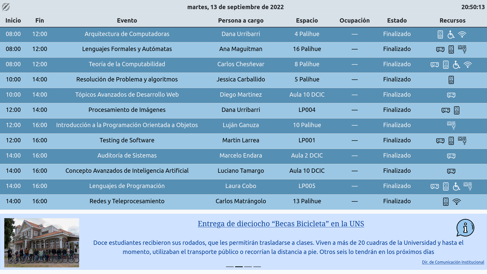
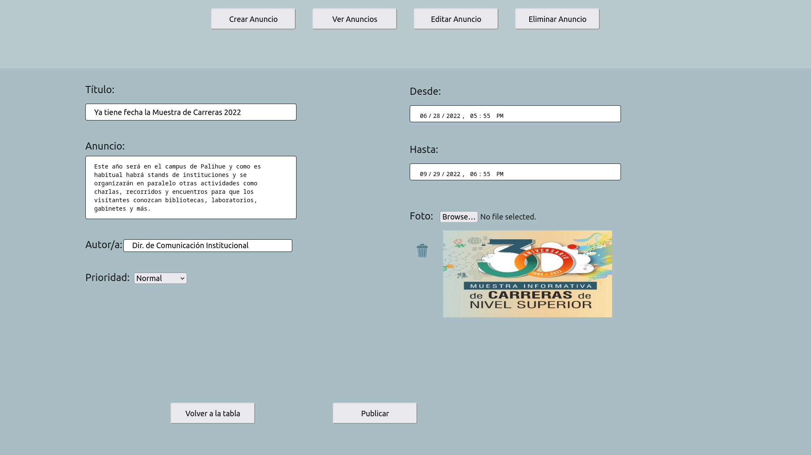

# Proyecto final

This project is an event and announcement visualization web application.

You can try it right now at https://bmmg-proyecto-final-uns.glitch.me/ and https://bmmg-proyecto-final-uns.glitch.me/admin

[](https://github.com/garatma/proyecto-final-uns/actions/workflows/codeql-analysis.yml)
[](https://github.com/garatma/proyecto-final-uns/actions/workflows/node.js.yml)

# Features

- Visualization of real time events and announcements
- Easy to access in a web app
- Easy to use admin app to create, view, edit or delete announcements
- Events and announcements stored in a small and portable database

# Components

- Main event and announcement visualization front-end, built with React.js
- Admin front-end, built with React.js, to create, edit, view and delete announcements
- SQLite database for storage
- Back-end, running on Node.js, that hosts both front-ends and provides services for database access

# Repo

The repo is organized as follows:
- **db**: holds everything database-related
- **doc**: pictures for this readme
- **src**: source code for the application

# Screenshots





# Building and running

## Dependencies

To build and run the project, you need `npm` and `node`.

## Building

To install all the dependencies and build the project, run:

```bash
npm install
npm run build
```

## Running

To run the whole project, execute the following command:

```bash
npm start
```

We also provide the following useful commands, specially for development/debugging:

- `npm run admin`: only run the admin front-end, on port 3000 (or next available port, if already used)
- `npm run backend`: only run the backend
- `npm run visualization`: only run the visualization front-end, on port 3000 (or next available port, if already used)

# About the project

This is the final project or Bárbara Mattioli and Manuel Garat for their Computer Engineering degree in the Universidad Nacional del Sur, Bahía Blanca, Argentina.